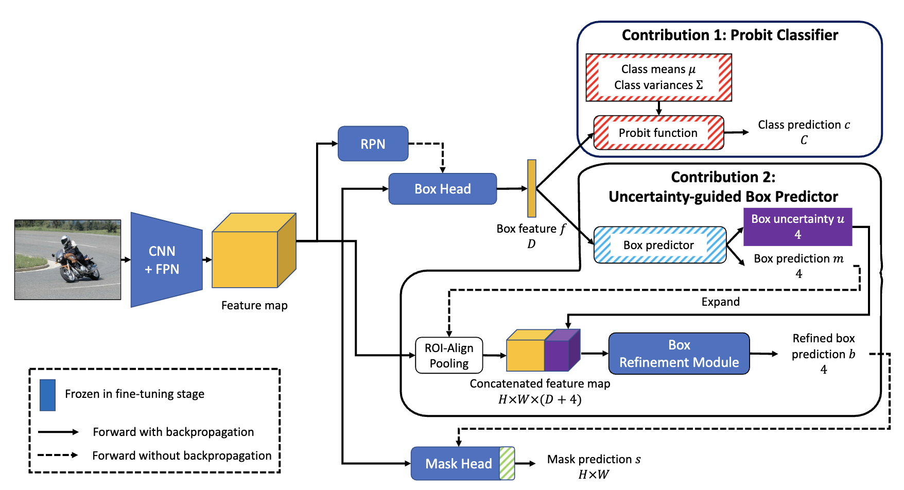

## Table of Contents
- [Table of Contents](#table-of-contents)
- [Installation](#installation)
- [Code Structure](#code-structure)
- [Data Preparation](#data-preparation)
- [Getting Started](#getting-started)
  - [Training & Evaluation in Command Line](#training--evaluation-in-command-line)
  - [Multiple Runs](#multiple-runs)


# **PyTorch implementation of iFS-RCNN: An Incremental Few-shot Instance Segmenter (CVPR 2022)**
<a href="https://arxiv.org/abs/2205.15562"></a>

[Khoi Nguyen (VinAI Research)](https://khoinguyen.org)
[Sinisa Todorovic (Oregon State University)](https://web.engr.oregonstate.edu/~sinisa/)

> **Abstract:** 
This paper addresses incremental few-shot instance segmentation, where a few examples of new object classes arrive when access to training examples of old classes is not available anymore, and the goal is to perform well on both old and new classes. We make two contributions by extending the common Mask-RCNN framework in its second stage -- namely, we specify a new object class classifier based on the probit function and a new uncertainty-guided bounding-box predictor. The former leverages Bayesian learning to address a paucity of training examples of new classes. The latter learns not only to predict object bounding boxes but also to estimate the uncertainty of the prediction as guidance for bounding box refinement. We also specify two new loss functions in terms of the estimated object-class distribution and bounding-box uncertainty. Our contributions produce significant performance gains on the COCO dataset over the state of the art -- specifically, the gain of +6 on the new classes and +16 on the old classes in the AP instance segmentation metric. Furthermore, we are the first to evaluate the incremental few-shot setting on the more challenging LVIS dataset.



Details of the model architecture and experimental results can be found in our [following paper](https://arxiv.org/abs/2205.15562):

```bibtex
@inproceedings{nguyen2022ifs,
  title={ifs-rcnn: An incremental few-shot instance segmenter},
  author={Nguyen, Khoi and Todorovic, Sinisa},
  booktitle={Proceedings of the IEEE/CVF conference on computer vision and pattern recognition},
  pages={7010--7019},
  year={2022}
}
```

Please **CITE** our paper whenever this repository is used to help produce published results or incorporated into other software.


## Installation

This codebase is primarily based on this codebase of https://github.com/ucbdrive/few-shot-object-detection

**Requirements**

* Linux with Python >= 3.6
* [PyTorch](https://pytorch.org/get-started/locally/) >= 1.4
* [torchvision](https://github.com/pytorch/vision/) that matches the PyTorch installation
* CUDA 10.0, 10.1, 10.2
* GCC >= 4.9

**Build fsdet**
* Create a virtual environment.
```angular2html
python3 -m venv fsdet
source fsdet/bin/activate
```
You can also use `conda` to create a new environment.
```angular2html
conda create --name fsdet
conda activate fsdet
```
* Install Pytorch 1.6 with CUDA 10.2 
```angular2html
pip install torch torchvision
```
You can choose the Pytorch and CUDA version according to your machine.
Just to make sure your Pytorch version matches the [prebuilt detectron2](https://github.com/facebookresearch/detectron2/blob/master/INSTALL.md#install-pre-built-detectron2-linux-only)
* Install Detectron2 v0.2.1
```angular2html
python3 -m pip install detectron2 -f \
  https://dl.fbaipublicfiles.com/detectron2/wheels/cu102/torch1.6/index.html
```
* Install other requirements. 
```angular2html
python3 -m pip install -r requirements.txt
```

## Code Structure
- **configs**: Configuration files
- **datasets**: Dataset files (see [Data Preparation](#data-preparation) for more details)
- **iFS-RCNN**
  - **checkpoint**: Checkpoint code.
  - **config**: Configuration code and default configurations.
  - **engine**: Contains training and evaluation loops and hooks.
  - **layers**: Implementations of different layers used in models.
  - **modeling**: Code for models, including backbones, proposal networks, and prediction heads.
- **tools**
  - **train_net.py**: Training script.
  - **test_net.py**: Testing script.
  - **ckpt_surgery.py**: Surgery on checkpoints.
  - **run_experiments.py**: Running experiments across many seeds.
  - **aggregate_seeds.py**: Aggregating results from many seeds.


## Data Preparation
We evaluate our models on two datasets:
- [COCO](http://cocodataset.org/): We use COCO 2014 and extract 5k images from the val set for evaluation and use the rest for training. We use the 20 object classes that are the same with PASCAL VOC as novel classes and use the rest as base classes.
- [LVIS](https://www.lvisdataset.org/): We treat the frequent and common classes as the base classes and the rare categories as the novel classes.

See [datasets/README.md](datasets/README.md) for more details.


## Getting Started


### Training & Evaluation in Command Line

+ To train a model on base classes, refer to the [train.sh](train.sh) script  

+ To fine-tune a model on novel classes, refer to the [finetuning.sh](finetuning.sh) script

+ To evaluate the trained models, refer to the [test.sh](test.sh) script 

### Multiple Runs

+ For multiple running experiments, refer to [run_experiments.sh](run_experiments.sh) script

+ To aggregate results of multiple runs, refer to [aggregate_seeds.sh](aggregate_seeds.sh) script

## Acknowledgments

This repo is built upon [fsdet](https://github.com/ucbdrive/few-shot-object-detection)

## Contacts

If you have any questions or suggestions about this repo, please feel free to contact me (ducminhkhoi@gmail.com).
